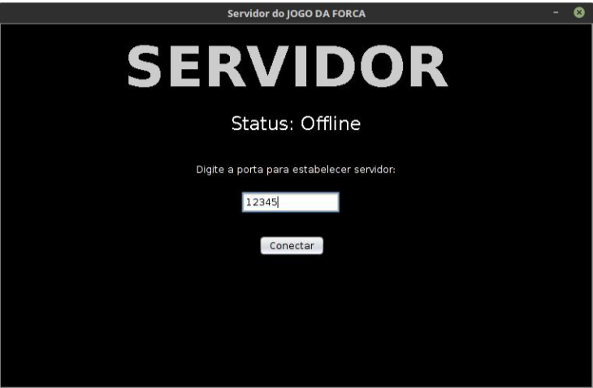
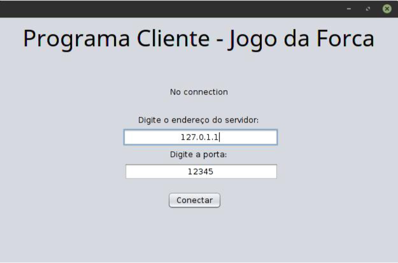
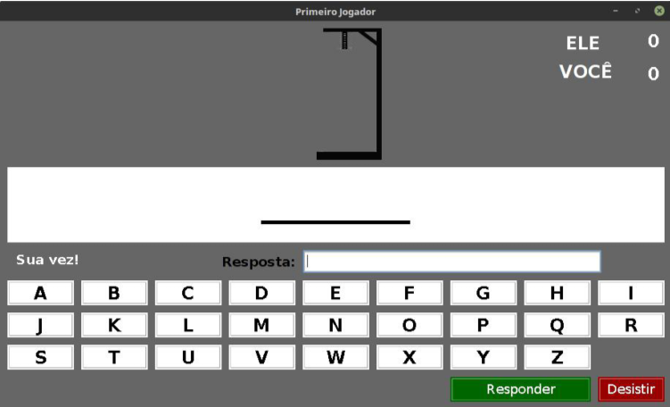

# Urna Eletrônica - Java

Trabalho Prático da disciplina de Redes de Computadores da 🏫 Universidade Federal de Viçosa - Campus Florestal. 

Este trabalho teve como o objetivo de desenvolver um jogo da forca usando Sockets em Java, em que dois jogadores poderiam jogar entre eles.

## 💻 Interface 

Abaixo temos a interface do Servidor.



Abaixo temos a interface de conexão do Cliente:



Abaixo temos a interface de do jogo da forca do Cliente:




********************************************


## 🚀 Começando

O projeto é dividido em duas parte, primeiro o servidor e segundo o cliente.

Para obter uma cópia deste projeto:

```shell
git clone https://github.com/adrianomqsmts/forca-sockets
cd forca-sockets
```

## 🛠️ Construído com

Ferramentas, linguagens e outras tecnologias usadas no desenvolvimento deste sistema.

* [NetBeans](https://netbeans.apache.org/) - Ambiente de Desenvolvimento
* [Git](https://git-scm.com/) - Controle de Versões
* [GUI Swing](https://docs.oracle.com/javase/tutorial/uiswing/learn/index.html) - Biblioteca de Interface integrada do NetBeans

## ✒️ Autores

* **Desenvolvedor** - *Código e Documentação* - [Adriano](https://github.com/adrianomqsmts)

## 📄 Licença

Este projeto está sob a licença MIT License - veja o arquivo [LICENSE.md](https://github.com/adrianomqsmts/forca-sockets/blob/master/LICENSE) para detalhes.

---
